<p align="center">
  
</p>

<h1 align="center">Aprovaura</h1>

<p align="center">
  App de estudio para el ENEM, exámenes de ingreso y otras pruebas de Brasil: preguntas por materia, simulacros personalizados, revisión de errores y práctica de redacción.
</p>

<p align="center">
  
  
  
  
  
</p>

<p align="center">
  <a href="README.md">English</a> · <a href="README.pt-BR.md">Português</a> · <b>Español</b>
</p>

---

Aprovaura reúne preguntas, simulacros, revisión de errores y redacción en un solo flujo de estudio. El estudiante elige una materia, responde y ve dónde se equivoca más. El nombre une *aprovação* (aprobar un examen) y **Aura**, la puntuación de la app: cada acierto suma Aura, y el Aura define el nivel del estudiante. La mascota, **Aurudo**, reacciona al progreso, como la meta del día, la racha y la subida de nivel.

## Disponibilidad

- **Android** e **iOS**, desde un único código en Flutter (el mismo código también genera la versión web).
- **Idiomas**: portugués (Brasil), inglés y español.
- **Temas**: claro y oscuro.

## Pantallas

### Práctica

<table>
<tr><td align="center" valign="top">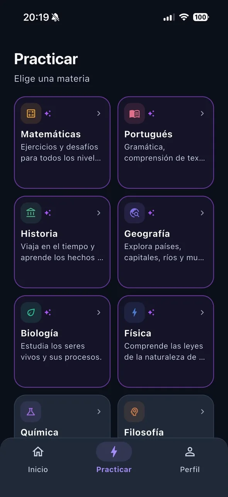<br><sub><b>Practicar</b></sub></td><td align="center" valign="top"><br><sub><b>Más materias</b></sub></td><td align="center" valign="top">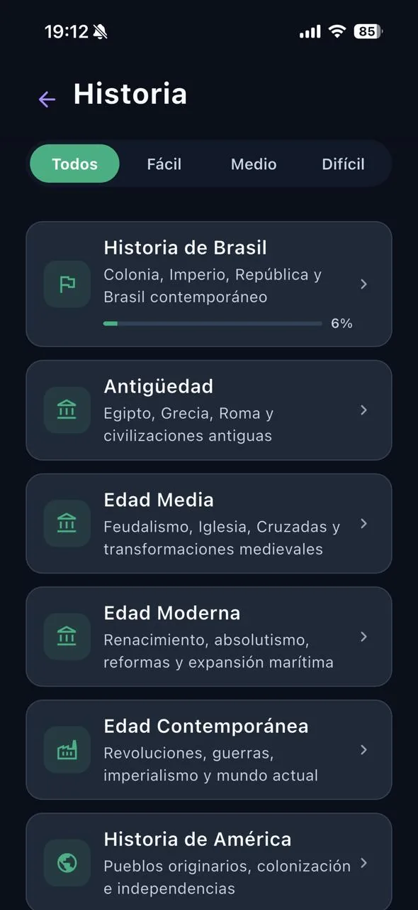<br><sub><b>Recorrido de la materia</b></sub></td></tr>
<tr><td align="center" valign="top">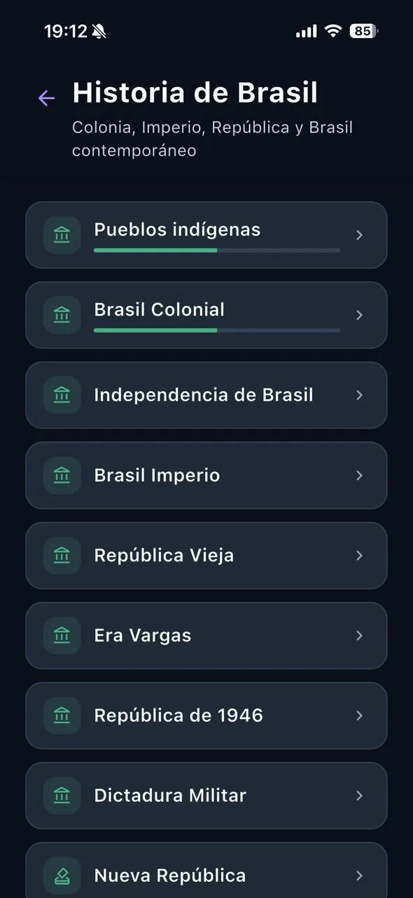<br><sub><b>Subtemas</b></sub></td><td align="center" valign="top">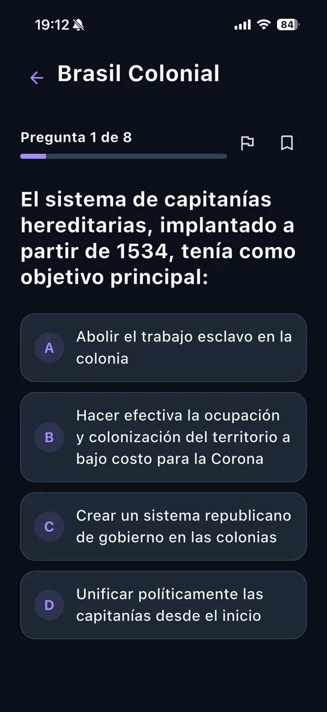<br><sub><b>Pregunta</b></sub></td></tr>
</table>

### Arma tu simulacro

<table>
<tr><td align="center" valign="top">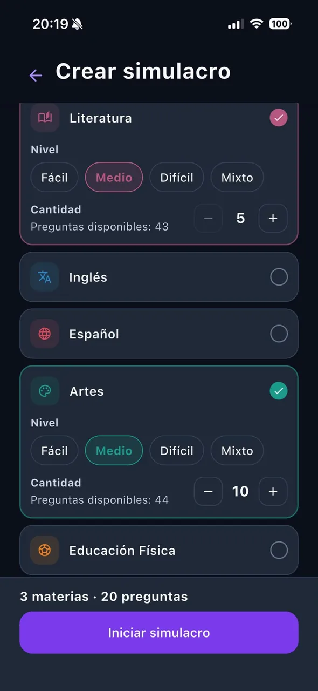<br><sub><b>Armado</b></sub></td><td align="center" valign="top"><br><sub><b>Más materias</b></sub></td><td align="center" valign="top">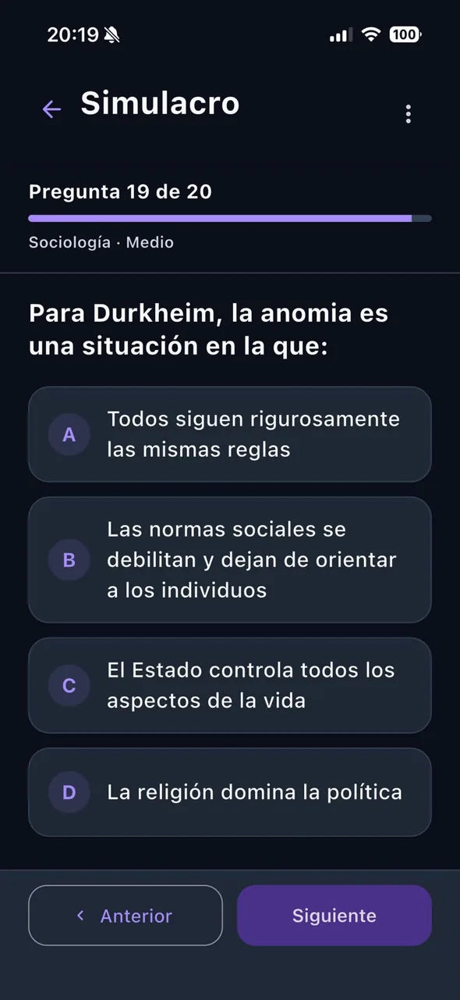<br><sub><b>Durante el examen</b></sub></td></tr>
</table>

### Corrección de redacción

<table>
<tr><td align="center" valign="top">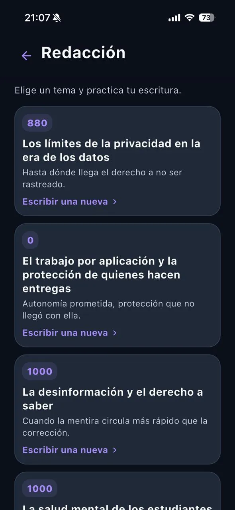<br><sub><b>Temas de redacción</b></sub></td><td align="center" valign="top"><br><sub><b>Propuesta</b></sub></td><td align="center" valign="top"><br><sub><b>Corrección en curso</b></sub></td></tr>
<tr><td align="center" valign="top">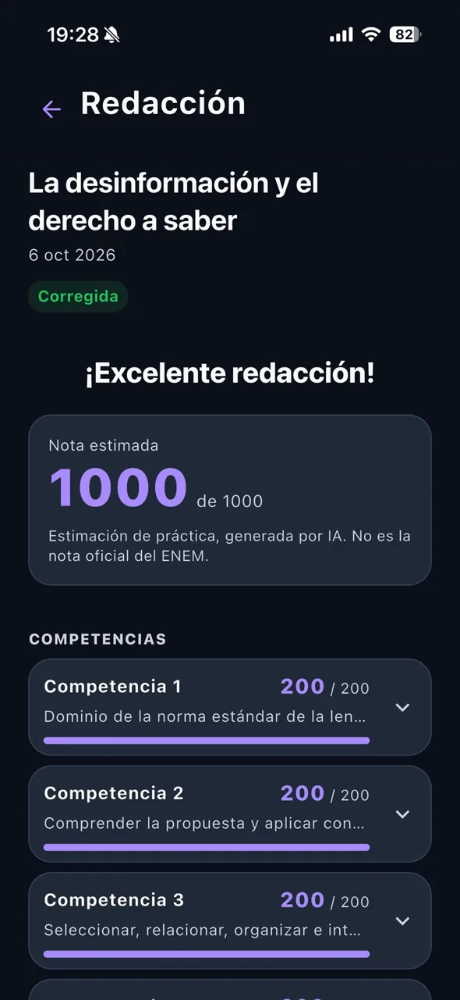<br><sub><b>Nota estimada</b></sub></td></tr>
</table>

### Mapas de Geografía

<table>
<tr><td align="center" valign="top">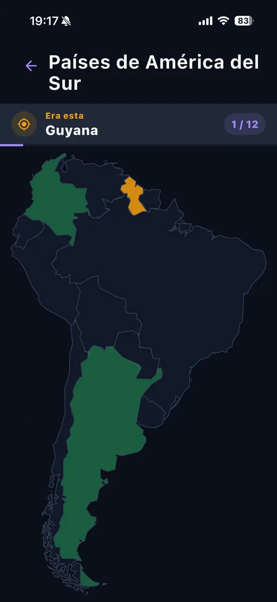<br><sub><b>Ubica en el mapa</b></sub></td><td align="center" valign="top"><br><sub><b>Conclusión</b></sub></td><td align="center" valign="top">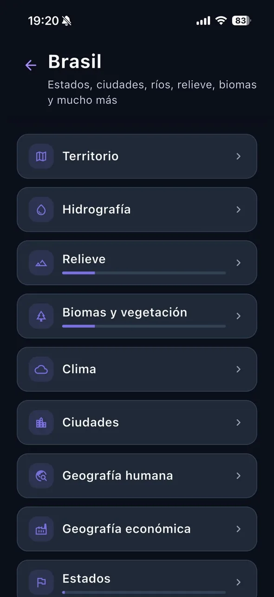<br><sub><b>Temas</b></sub></td></tr>
</table>

### Meta del día, Aura y progreso

<table>
<tr><td align="center" valign="top">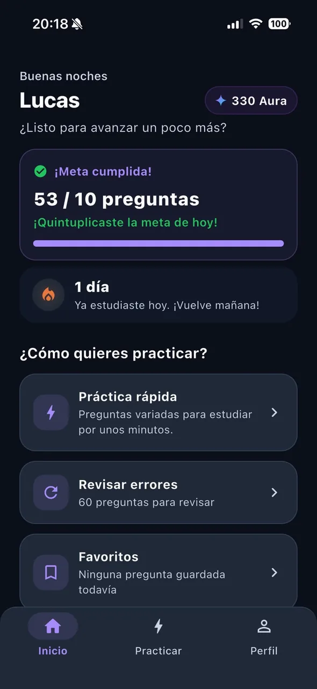<br><sub><b>Inicio</b></sub></td><td align="center" valign="top">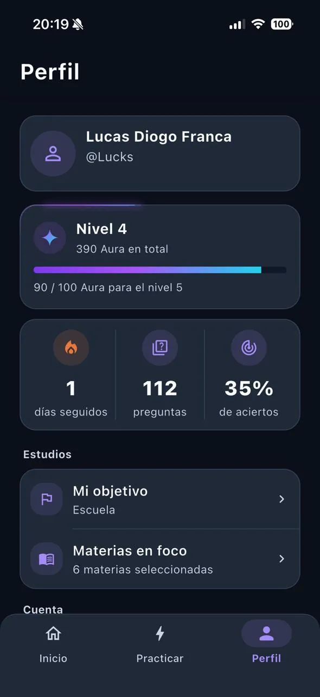<br><sub><b>Perfil</b></sub></td><td align="center" valign="top"><br><sub><b>Subiste de nivel</b></sub></td></tr>
</table>

## Funcionalidades

**Materias y contenido**
- Matemáticas, Portugués, Historia, Geografía, Biología, Física, Química, Filosofía, Sociología, Literatura, Inglés, Español, Artes, Educación Física y Actualidad, además de la sección de Redacción.
- Contenido organizado en un árbol de temas y subtemas por materia, cada uno con su barra de progreso.
- Filtro de dificultad (fácil, media y difícil) en la raíz de cada materia.
- **Actualidad** usa un formato propio de dosier (contexto, qué pasó, por qué importa, quiénes participan, consecuencias y fuentes), cada uno con su práctica.

**Práctica**
- Preguntas de opción múltiple con respuesta inmediata y explicación.
- Marcar cualquier pregunta como favorita o reportar un problema.
- **Práctica rápida**: un bloque de preguntas nunca respondidas, una por materia en cada ronda.
- **Revisar errores**: respuestas incorrectas agrupadas por materia y tema, repetidas hasta acertarlas.
- **Favoritas**: práctica solo con las preguntas guardadas.

**Simulacros**
- Combina materias y elige, para cada una, la dificultad (fácil, media, difícil o mixta) y la cantidad de preguntas.
- El servidor sortea las preguntas y fija el orden de preguntas y alternativas; un simulacro sin terminar queda guardado y se puede retomar.
- Modo examen: las respuestas correctas solo se muestran al terminar, y el resultado alimenta entonces el progreso y la revisión de errores.

**Redacción**
- Temas con la propuesta completa y los textos de apoyo en formato ENEM, editor con borradores e historial de intentos por tema.
- **Corrección asistida por IA** (ver [Cómo se usa la IA](#cómo-se-usa-la-ia)): nota estimada de 0 a 1000, dividida en las cinco competencias del ENEM, cada una con su nota y comentario. La corrección se ejecuta en segundo plano: el estudiante puede salir de la app y volver más tarde por el resultado.

**Mapas interactivos**
- Actividades de Geografía en mapas interactivos: toca el estado, país, río o ciudad correctos, además de identificar banderas. Los aciertos suman Aura.

**Progreso y motivación**
- **Aura**: se gana con cada acierto; el nivel del estudiante sale del total de Aura.
- **Meta del día** de preguntas respondidas y **racha** de días seguidos de estudio (hora de Brasilia).
- Reacciones y animaciones de **Aurudo** al completar actividades, la meta del día, la racha, la subida de nivel y el resultado de la redacción.
- Perfil con nivel, Aura, racha, preguntas respondidas y porcentaje de aciertos.

**Cuenta**
- Inicio de sesión con correo y recuperación de contraseña, onboarding con objetivo (ENEM, exámenes de ingreso, oposiciones, escuela o estudio por cuenta propia), año del examen y materias de interés.
- Ajustes de idioma y tema y eliminación de la cuenta por el propio usuario.

## Cómo se usa la IA

La IA se usa en un único lugar: **la corrección de redacciones**.

- Cuando el estudiante envía una redacción, una Edge Function de Supabase envía la propuesta del tema, los textos de apoyo y el texto de la redacción a la **API de Google Gemini** y pide una evaluación estructurada según las cinco competencias del ENEM.
- No se envía ningún nombre, correo ni identificador interno junto con la redacción.
- El resultado se muestra como una **estimación de práctica**, no como nota oficial, y la app explica qué se comparte antes del envío.
- Hay un límite diario de correcciones por estudiante, controlado en el servidor.

Las preguntas, explicaciones, simulacros y mapas no usan IA durante el uso de la app.

## Arquitectura

- **App Flutter** con Clean Architecture organizada por feature (domain, data, presentation), Cubits para todo el estado de la interfaz, `get_it` para la inyección de dependencias y `go_router` para la navegación. Los errores se modelan con un tipo `Result` explícito, sin excepciones que crucen capas.
- **Supabase** para autenticación, PostgreSQL y almacenamiento. El progreso, el Aura, la racha, los simulacros y las redacciones solo se escriben mediante RPCs `security definer`: el cliente informa la respuesta, pero nunca define su propia puntuación.
- **Puntuación idempotente.** El Aura se acredita mediante un registro con clave por intento, así que los reintentos o una pantalla de resultado montada dos veces nunca duplican la recompensa. La corrección de redacciones sigue la misma regla y además aplica el límite diario.
- **Integridad del modo examen.** Mientras el simulacro está en curso, la base de datos nunca devuelve respuestas correctas ni explicaciones y no toca el progreso; todo se resuelve al terminar.
- **Edge Functions** para la evaluación de redacciones y la eliminación de cuentas. La clave de la API de Gemini solo existe en el entorno de la función y nunca llega a la app.
- **Localización.** Los textos de la interfaz se localizan por feature, y el contenido (catálogo, preguntas, actualidad, redacción) tiene traducciones guardadas en la base de datos.

## Tecnologías

| Capa | Tecnología |
| --- | --- |
| App | Flutter, Dart |
| Estado | `flutter_bloc` (Cubit) |
| DI / Navegación | `get_it`, `go_router` |
| Backend | Supabase: Auth, PostgreSQL, RLS, RPCs, Edge Functions (Deno) |
| Mapas | `flutter_map` con GeoJSON incluido |
| IA (solo corrección de redacción) | API de Google Gemini |
| Tests | `flutter_test` |

## Estructura del proyecto

```
lib/
├── core/           DI, rutas, tema, manejo de errores, l10n, config
├── shared/         widgets y utilidades reutilizables
└── features/
    ├── auth/  onboarding/  home/  profile/
    ├── subjects/  catalog/  questions/  practice/
    ├── mock_exam/  essay/  map_quiz/  atualidades/
    ├── progress/  xp/  streak/  error_review/  favorites/
    └── aurudo_reaction/

supabase/           SQL de esquema, RLS, RPCs y contenido, además de las Edge Functions
tool/               scripts de mantenimiento de contenido
```

## Ejecución local

Requisitos: Flutter (canal stable) y un proyecto de Supabase.

1. Copia `env.example.json` a `env.json` y completa la URL del proyecto de Supabase y la publishable key.
2. Aplica los archivos SQL de `supabase/` en el proyecto (primero los de esquema y luego los de contenido). Lee [`supabase/LEIA_ANTES_DE_REAPLICAR.md`](supabase/LEIA_ANTES_DE_REAPLICAR.md) antes de volver a aplicar cualquier cosa.
3. Ejecuta la app:

```bash
flutter pub get
flutter run --dart-define-from-file=env.json
```

```bash
flutter analyze
flutter test
```

## Estado del proyecto

En desarrollo activo.

## Licencia

No se concede ninguna licencia de código abierto. El código está visible como parte de un portafolio; todos los derechos reservados.

## Acerca de

Desarrollado por Lucas Diogo França. Caso de estudio: [lucksrei.com/projects/aura](https://lucksrei.com/projects/aura/)
