<p align="center">
  
</p>

<h1 align="center">Aprovaura</h1>

<p align="center">
  A study app for Brazil's ENEM, university entrance exams and other tests: questions by subject, custom mock exams, mistake review and essay practice.
</p>

<p align="center">
  
  
  
  
  
</p>

<p align="center">
  <b>English</b> · <a href="README.pt-BR.md">Português</a> · <a href="README.es.md">Español</a>
</p>

---

Aprovaura brings questions, mock exams, mistake review and essay writing into a single study flow. Students pick a subject, answer, and see where they miss the most. The name joins *aprovação* (passing an exam) and **Aura**, the app's score: every correct answer earns Aura, and Aura sets the student's level. The app's mascot, **Aurudo**, reacts to progress such as daily goals, streaks and level-ups.

## Availability

- **Android** and **iOS**, from a single Flutter codebase (the same code also builds for the web).
- **Languages**: Portuguese (Brazil), English and Spanish.
- **Themes**: light and dark.

## Screenshots

### Practice

<table>
<tr><td align="center" valign="top">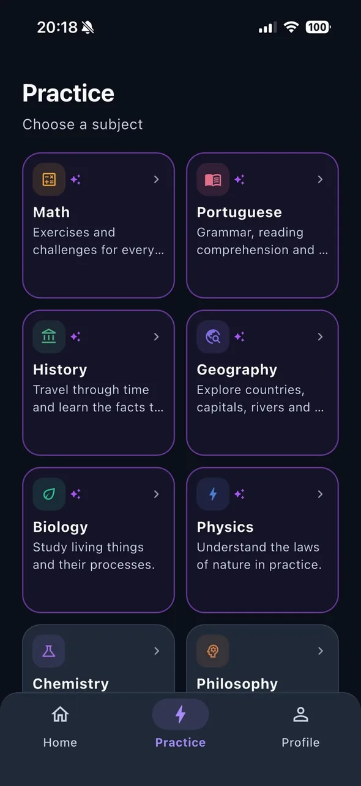<br><sub><b>Practice</b></sub></td><td align="center" valign="top">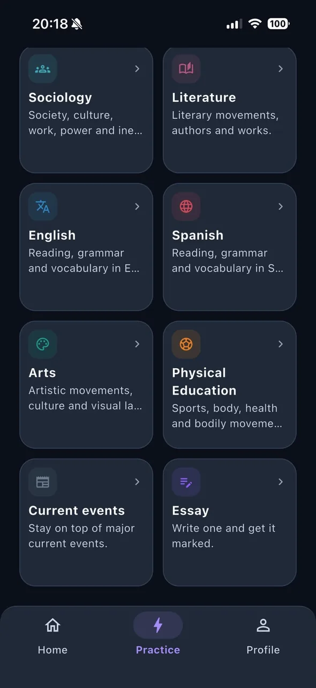<br><sub><b>More subjects</b></sub></td><td align="center" valign="top">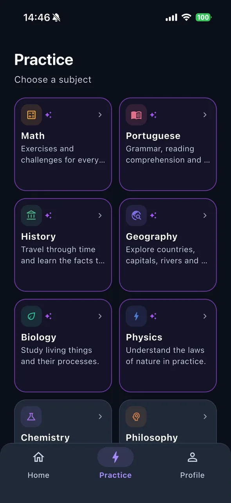<br><sub><b>Subject path</b></sub></td></tr>
<tr><td align="center" valign="top">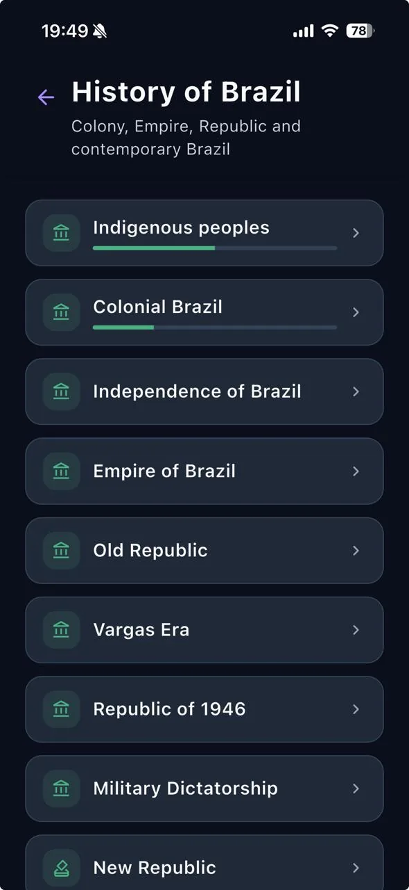<br><sub><b>Subtopics</b></sub></td><td align="center" valign="top">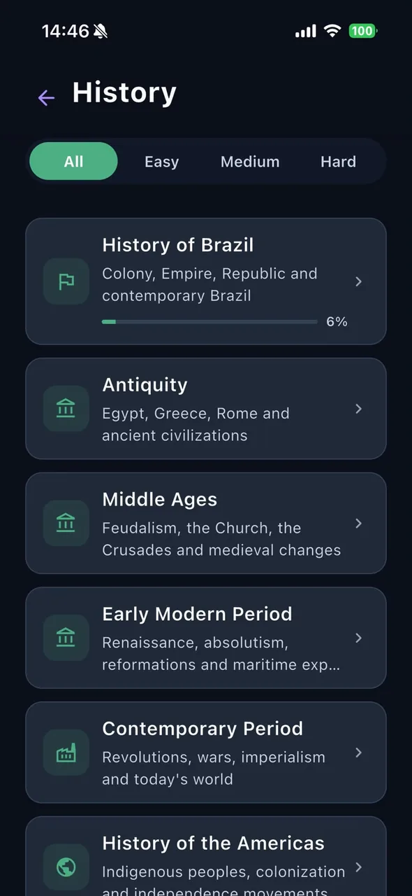<br><sub><b>Question</b></sub></td></tr>
</table>

### Build your own mock exam

<table>
<tr><td align="center" valign="top">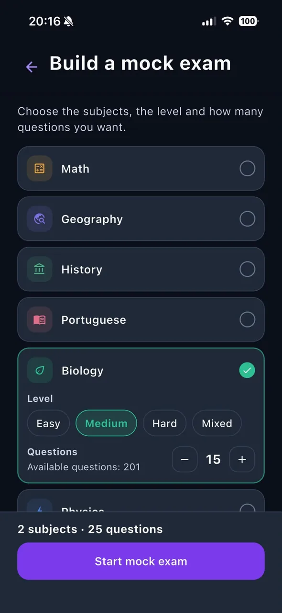<br><sub><b>Setup</b></sub></td><td align="center" valign="top">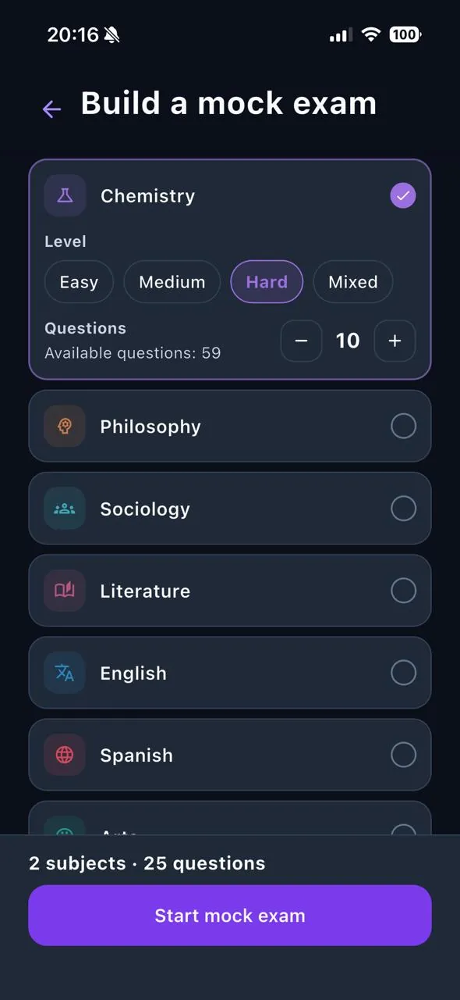<br><sub><b>More subjects</b></sub></td><td align="center" valign="top">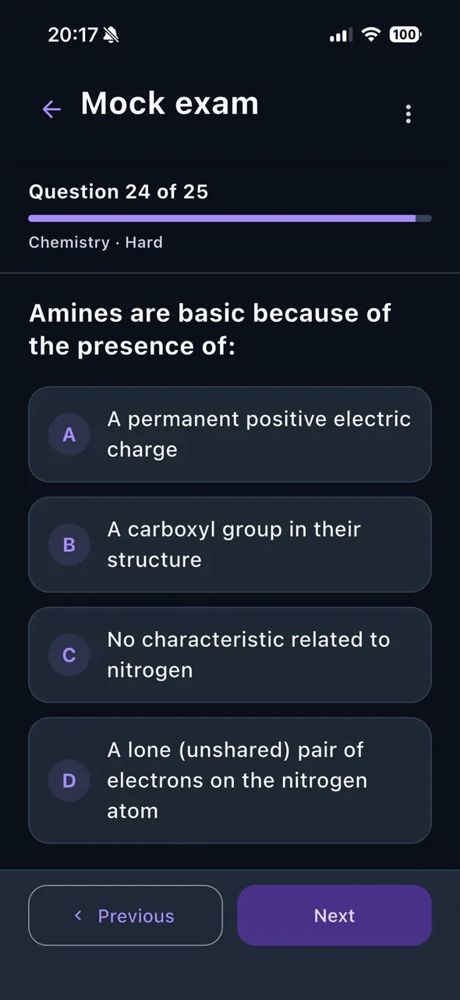<br><sub><b>During the exam</b></sub></td></tr>
</table>

### Essay grading

<table>
<tr><td align="center" valign="top">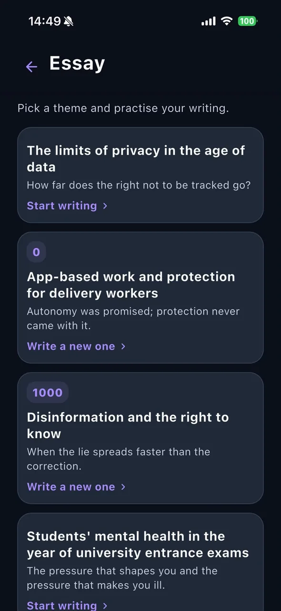<br><sub><b>Essay topics</b></sub></td><td align="center" valign="top">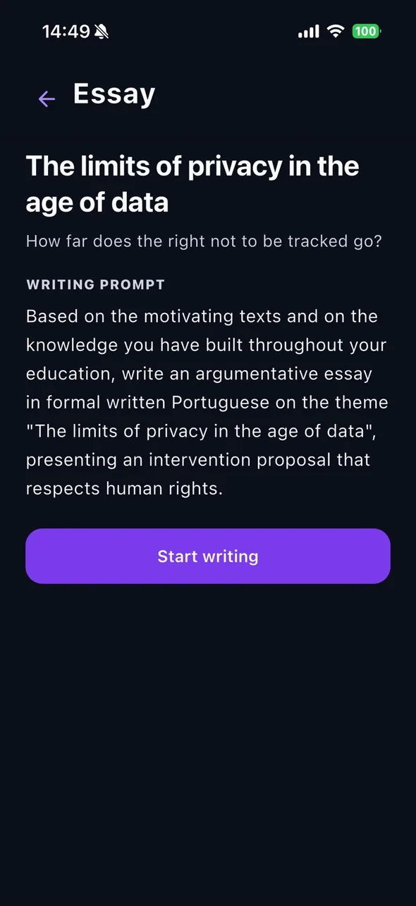<br><sub><b>Prompt</b></sub></td><td align="center" valign="top">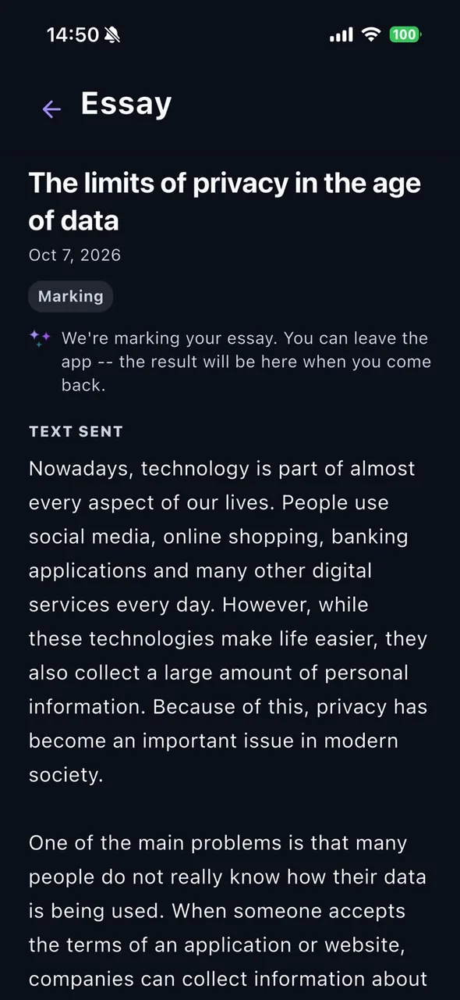<br><sub><b>Grading in progress</b></sub></td></tr>
<tr><td align="center" valign="top">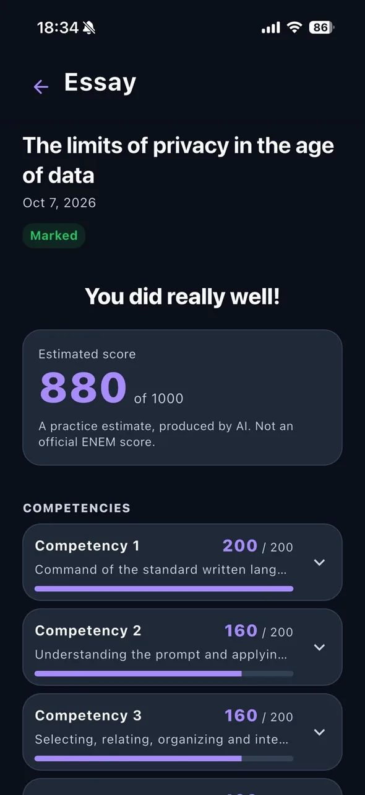<br><sub><b>Estimated score</b></sub></td></tr>
</table>

### Geography maps

<table>
<tr><td align="center" valign="top">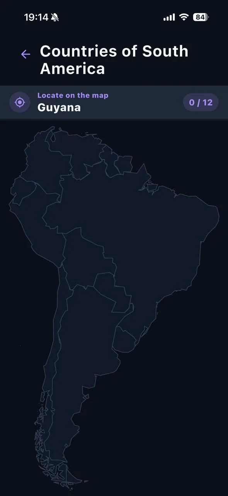<br><sub><b>Locate on the map</b></sub></td><td align="center" valign="top">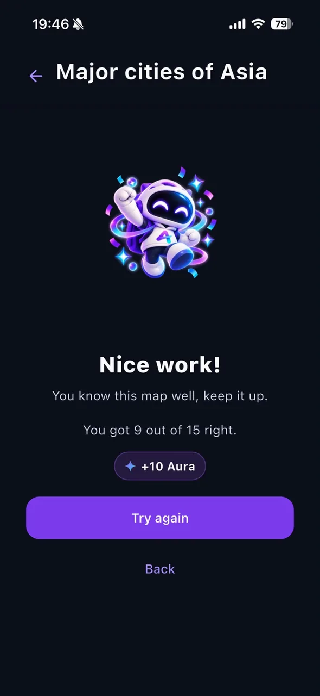<br><sub><b>Completion</b></sub></td><td align="center" valign="top">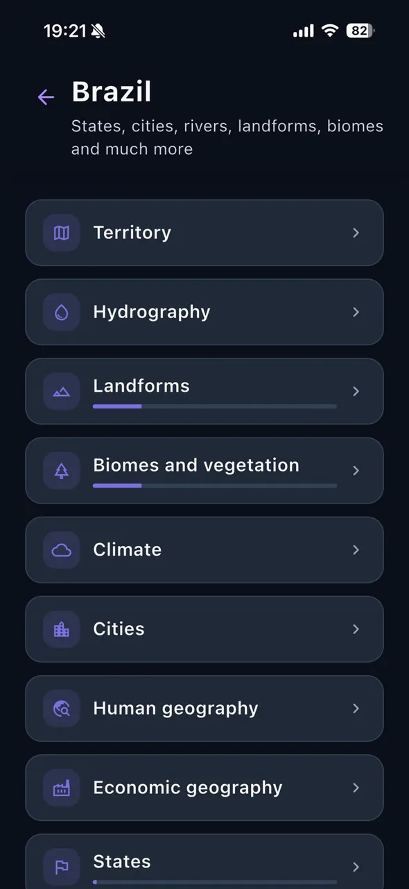<br><sub><b>Topics</b></sub></td></tr>
</table>

### Daily goal, Aura and progress

<table>
<tr><td align="center" valign="top">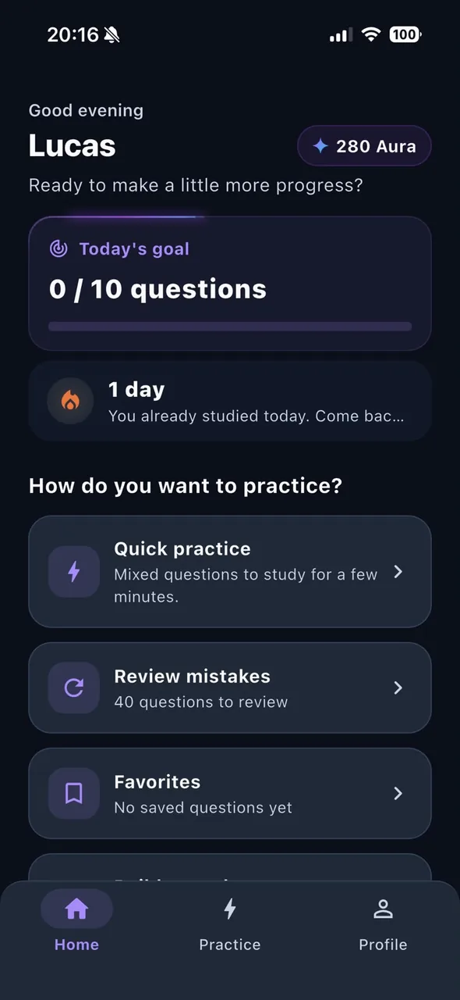<br><sub><b>Home</b></sub></td><td align="center" valign="top">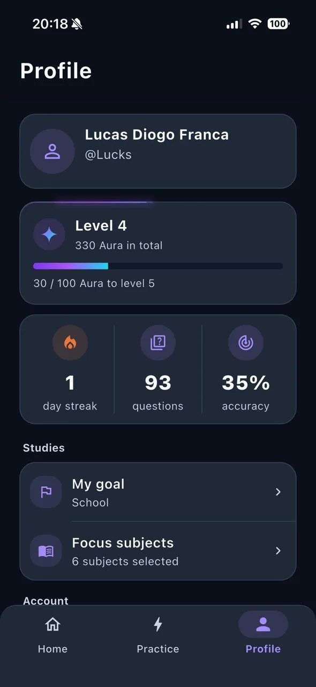<br><sub><b>Profile</b></sub></td><td align="center" valign="top">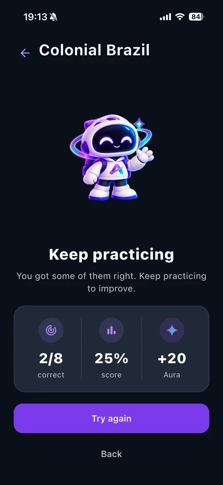<br><sub><b>Level up</b></sub></td></tr>
</table>

## Features

**Subjects and content**
- Mathematics, Portuguese, History, Geography, Biology, Physics, Chemistry, Philosophy, Sociology, Literature, English, Spanish, Arts, Physical Education and Current Events, plus an Essay section.
- Content organized as a tree of topics and subtopics per subject, each node with its own progress bar.
- Easy, medium and hard difficulty filter at the root of each subject.
- **Current Events** uses a separate dossier format (context, what happened, why it matters, who is involved, consequences and sources), each with its own practice quiz.

**Practice**
- Multiple-choice questions with immediate feedback and explanations.
- Bookmark any question as a favorite, or report a problem with it.
- **Quick practice**: a deck of questions the student has never answered, one per subject per round.
- **Mistake review**: wrong answers grouped by subject and topic, replayed until they are answered correctly.
- **Favorites**: practice only bookmarked questions.

**Mock exams**
- Combine subjects and choose, per subject, the difficulty (easy, medium, hard or mixed) and the number of questions.
- The server draws the questions and freezes the order of questions and options; an unfinished exam is saved and can be resumed.
- Exam mode: correct answers are only revealed when the exam is finished, and results then feed progress and mistake review.

**Essay**
- Essay topics with the full prompt and supporting texts in ENEM format, an editor with drafts, and the history of attempts per topic.
- **AI-assisted grading** (see [How AI is used](#how-ai-is-used)): an estimated score from 0 to 1000, split into ENEM's five competencies, each with its own score and feedback. Grading runs in the background, so students can leave the app and come back for the result.

**Interactive maps**
- Geography activities on interactive maps: tap the right state, country, river or city, plus flag identification. Correct answers earn Aura.

**Progress and motivation**
- **Aura**: earned per correct answer; the student's level is derived from total Aura.
- **Daily goal** of answered questions and a **streak** of consecutive study days (Brasília time).
- **Aurudo** reactions and animations for completed activities, daily goals, streaks, level-ups and essay results.
- Profile with level, Aura, streak, questions answered and accuracy.

**Account**
- Email sign-in and password recovery, onboarding with goal (ENEM, entrance exams, civil service exams, school or self-study), exam year and focus subjects.
- Language and theme settings, and self-service account deletion.

## How AI is used

AI is used in one place only: **essay grading**.

- When a student submits an essay, a Supabase Edge Function sends the topic prompt, the supporting texts and the essay text to the **Google Gemini API** and asks for a structured evaluation based on ENEM's five competencies.
- No name, email or internal identifier is sent with the essay.
- The result is shown as an **estimate for practice**, not as an official score, and the app explains what is shared before the essay is submitted.
- There is a daily limit of essay gradings per student, enforced on the server.

Questions, explanations, mock exams and maps do not use AI at runtime.

## Architecture

- **Flutter app** with feature-first Clean Architecture (domain, data, presentation), Cubits for all UI state, `get_it` for dependency injection and `go_router` for navigation. Errors are modeled with an explicit `Result` type instead of exceptions crossing layers.
- **Supabase** for authentication, PostgreSQL and storage. Progress, Aura, streaks, mock exams and essays are written only through `security definer` RPCs, so the client can report an answer but never set its own score.
- **Idempotent scoring.** Aura is credited through a ledger keyed by attempt, so retries or a result screen mounted twice never double the reward. The same rule applies to essay grading, which also enforces the daily limit.
- **Exam-mode integrity.** While a mock exam is in progress, the database never returns correct answers or explanations and does not touch progress; everything is resolved when the exam is finished.
- **Edge Functions** for essay evaluation and account deletion. The Gemini API key exists only in the function's environment and never reaches the app.
- **Localization.** UI strings are localized per feature, and content (catalog, questions, current events, essays) has translations stored in the database.

## Tech stack

| Layer | Technology |
| --- | --- |
| App | Flutter, Dart |
| State | `flutter_bloc` (Cubit) |
| DI / Routing | `get_it`, `go_router` |
| Backend | Supabase: Auth, PostgreSQL, RLS, RPCs, Edge Functions (Deno) |
| Maps | `flutter_map` with bundled GeoJSON |
| AI (essay grading only) | Google Gemini API |
| Tests | `flutter_test` |

## Project structure

```
lib/
├── core/           DI, routing, theme, error handling, l10n, config
├── shared/         reusable widgets and utilities
└── features/
    ├── auth/  onboarding/  home/  profile/
    ├── subjects/  catalog/  questions/  practice/
    ├── mock_exam/  essay/  map_quiz/  atualidades/
    ├── progress/  xp/  streak/  error_review/  favorites/
    └── aurudo_reaction/

supabase/           SQL for schema, RLS, RPCs and content, plus Edge Functions
tool/               content maintenance scripts
```

## Running locally

Requirements: Flutter (stable channel) and a Supabase project.

1. Copy `env.example.json` to `env.json` and fill in the Supabase project URL and publishable key.
2. Apply the SQL files in `supabase/` to the project (schema files first, then content). Read [`supabase/LEIA_ANTES_DE_REAPLICAR.md`](supabase/LEIA_ANTES_DE_REAPLICAR.md) before re-applying anything.
3. Run the app:

```bash
flutter pub get
flutter run --dart-define-from-file=env.json
```

```bash
flutter analyze
flutter test
```

## Project status

Active development.

## License

No open-source license is granted. The source code is visible as part of a portfolio; all rights are reserved.

## About

Built by Lucas Diogo França. Case study: [lucksrei.com/projects/aura](https://lucksrei.com/projects/aura/)
