<p align="center">
  
</p>

<h1 align="center">Aprovaura</h1>

<p align="center">
  App de estudo para ENEM, vestibulares e provas: questões por matéria, simulados personalizados, revisão de erros e treino de redação.
</p>

<p align="center">
  
  
  
  
  
</p>

<p align="center">
  <a href="README.md">English</a> · <b>Português</b> · <a href="README.es.md">Español</a>
</p>

---

O Aprovaura reúne questões, simulados, revisão de erros e redação num só fluxo de estudo. O aluno escolhe uma matéria, responde e vê onde mais erra. O nome junta *aprovação* e **Aura**, a pontuação do app: cada acerto rende Aura, e a Aura define o nível do aluno. O mascote, **Aurudo**, reage ao progresso, como meta do dia, sequência de estudo e subida de nível.

## Disponibilidade

- **Android** e **iOS**, a partir de uma única base em Flutter (o mesmo código também gera a versão web).
- **Idiomas**: português (Brasil), inglês e espanhol.
- **Temas**: claro e escuro.

## Telas

### Praticar

<table>
<tr><td align="center" valign="top">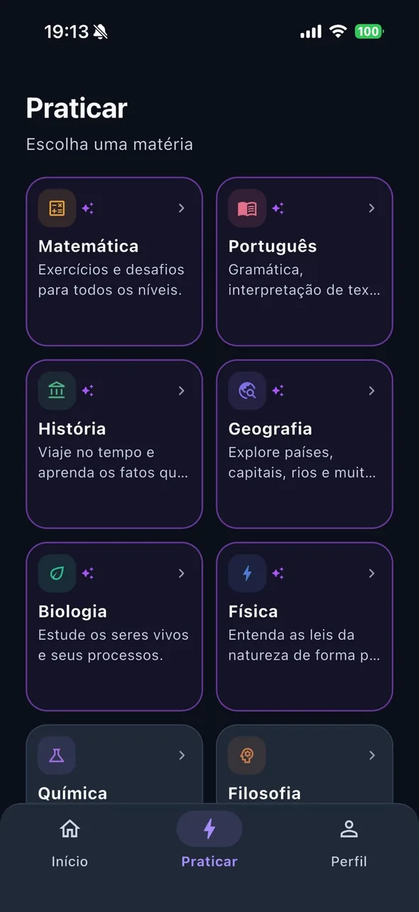<br><sub><b>Praticar</b></sub></td><td align="center" valign="top">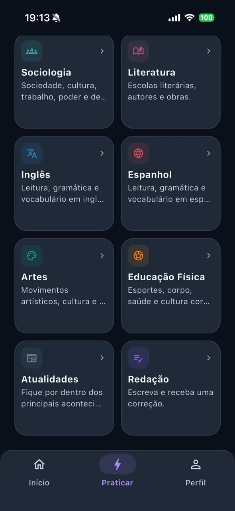<br><sub><b>Mais matérias</b></sub></td><td align="center" valign="top">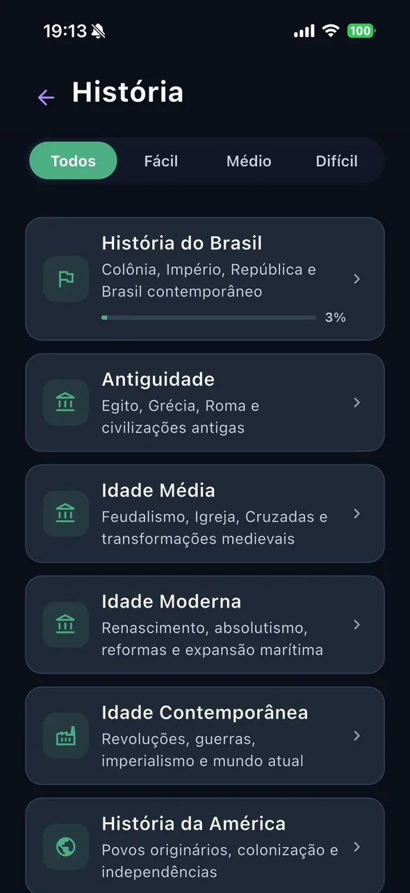<br><sub><b>Trilha da matéria</b></sub></td></tr>
<tr><td align="center" valign="top">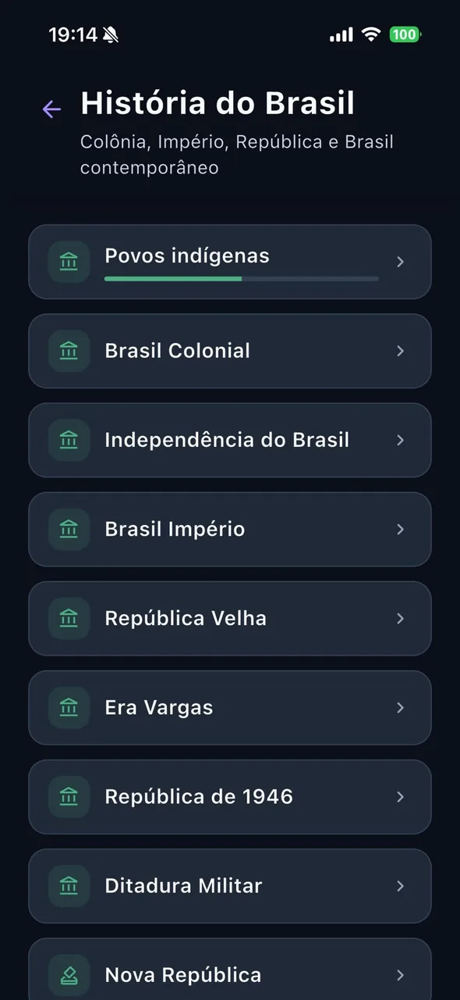<br><sub><b>Subtemas</b></sub></td><td align="center" valign="top">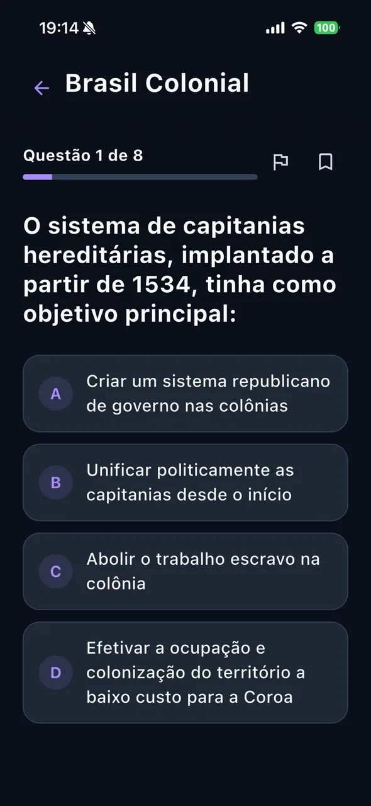<br><sub><b>Questão</b></sub></td></tr>
</table>

### Monte seu simulado

<table>
<tr><td align="center" valign="top">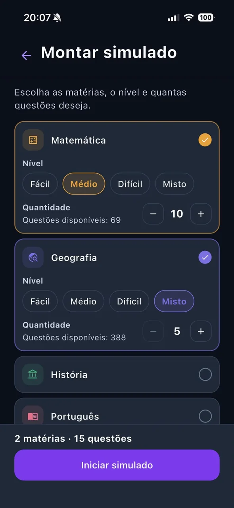<br><sub><b>Montagem</b></sub></td><td align="center" valign="top">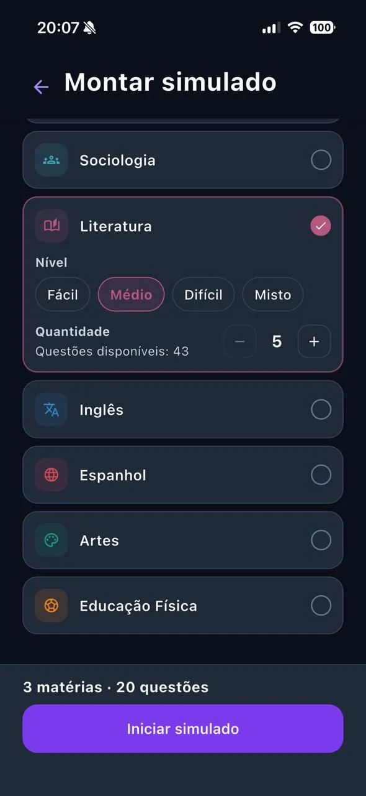<br><sub><b>Mais matérias</b></sub></td><td align="center" valign="top">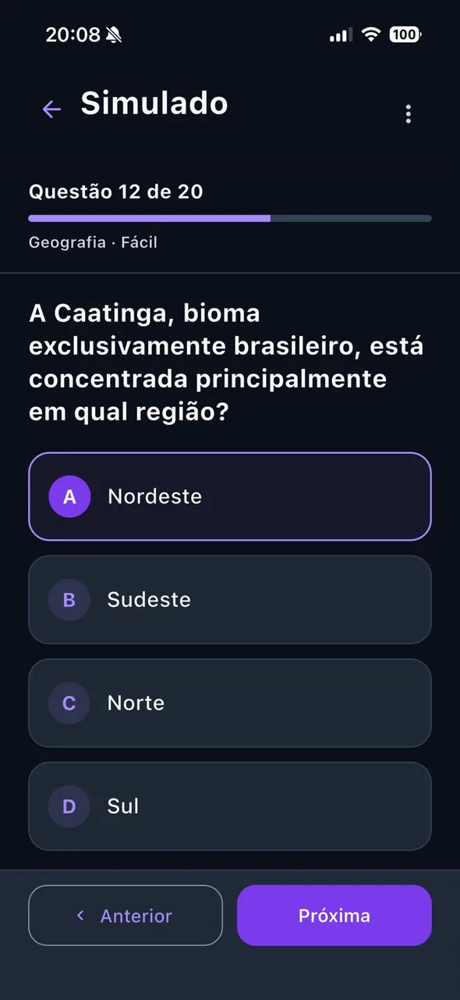<br><sub><b>Durante a prova</b></sub></td></tr>
</table>

### Correção de redação

<table>
<tr><td align="center" valign="top"><br><sub><b>Temas de redação</b></sub></td><td align="center" valign="top">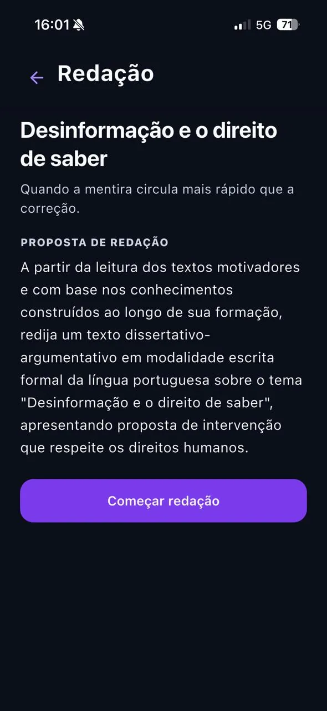<br><sub><b>Proposta</b></sub></td><td align="center" valign="top">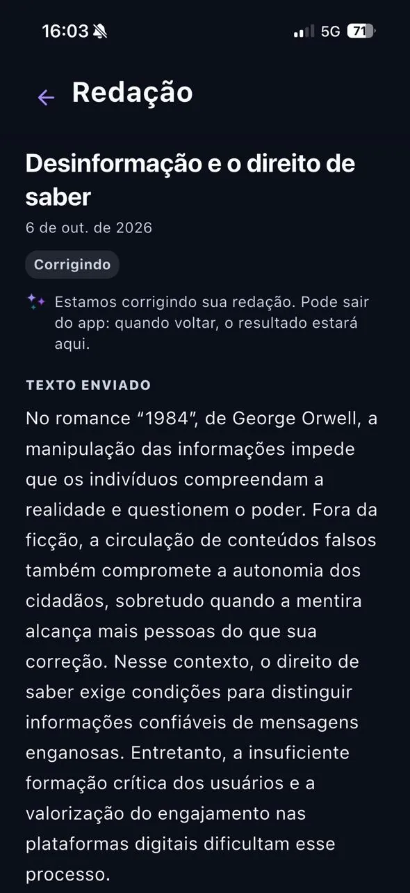<br><sub><b>Correção em andamento</b></sub></td></tr>
<tr><td align="center" valign="top">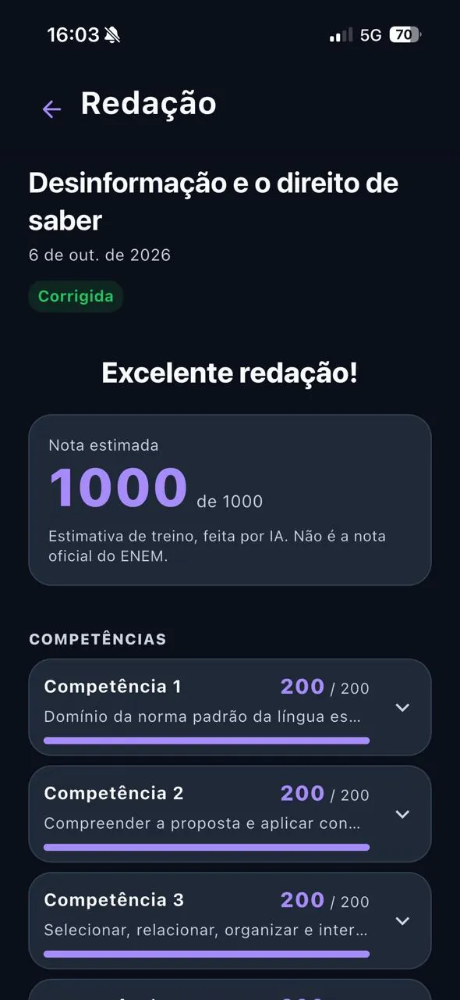<br><sub><b>Nota estimada</b></sub></td></tr>
</table>

### Mapas de Geografia

<table>
<tr><td align="center" valign="top">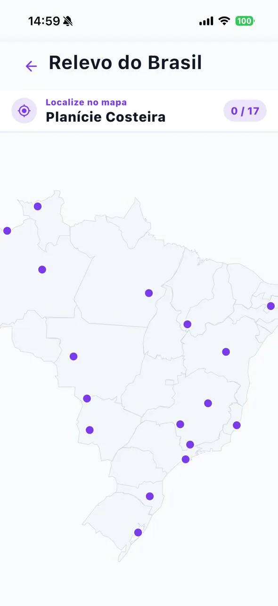<br><sub><b>Localize no mapa</b></sub></td><td align="center" valign="top"><br><sub><b>Conclusão</b></sub></td><td align="center" valign="top">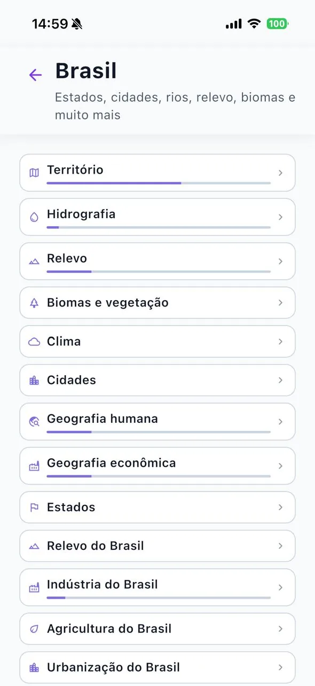<br><sub><b>Tópicos</b></sub></td></tr>
</table>

### Meta do dia, Aura e progresso

<table>
<tr><td align="center" valign="top">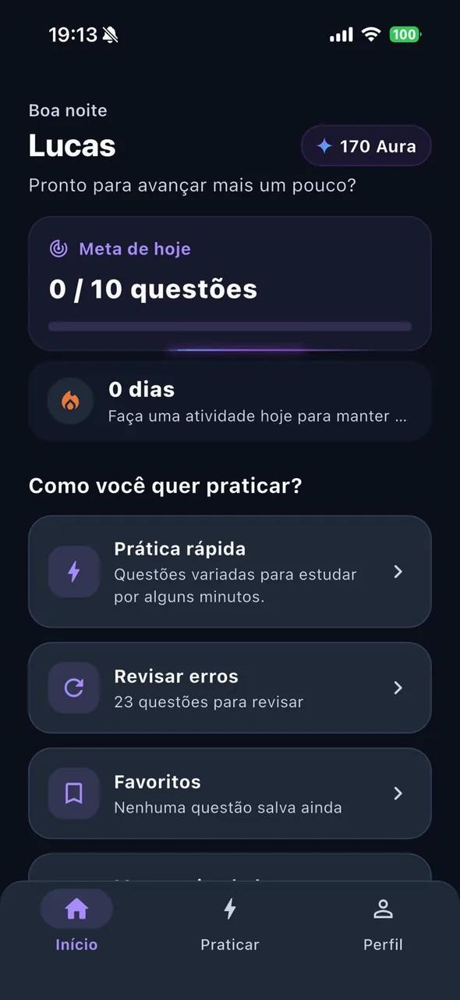<br><sub><b>Início</b></sub></td><td align="center" valign="top">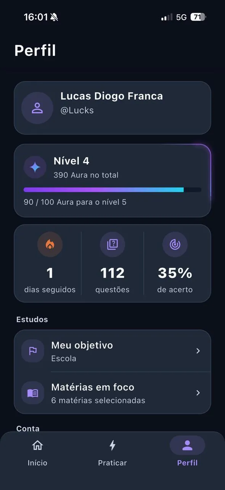<br><sub><b>Perfil</b></sub></td><td align="center" valign="top">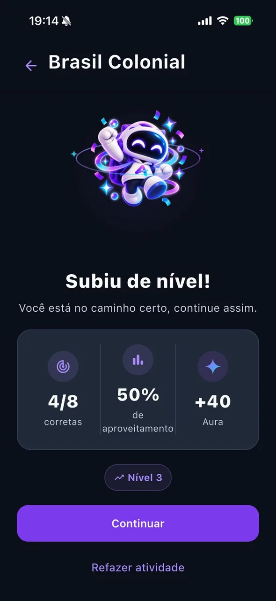<br><sub><b>Subiu de nível</b></sub></td></tr>
</table>

## Funcionalidades

**Matérias e conteúdo**
- Matemática, Português, História, Geografia, Biologia, Física, Química, Filosofia, Sociologia, Literatura, Inglês, Espanhol, Artes, Educação Física e Atualidades, além da área de Redação.
- Conteúdo organizado em árvore de tópicos e subtópicos por matéria, cada um com sua barra de progresso.
- Filtro de dificuldade (fácil, médio e difícil) na raiz de cada matéria.
- **Atualidades** usa um formato próprio de dossiê (contexto, o que aconteceu, por que importa, quem está envolvido, consequências e fontes), cada um com sua prática.

**Prática**
- Questões de múltipla escolha com retorno imediato e explicação.
- Favoritar qualquer questão ou reportar um problema nela.
- **Prática rápida**: um bloco de questões nunca respondidas, uma por matéria a cada rodada.
- **Revisar erros**: respostas erradas agrupadas por matéria e tópico, refeitas até o acerto.
- **Favoritas**: prática só com as questões salvas.

**Simulados**
- Combine matérias e escolha, para cada uma, a dificuldade (fácil, médio, difícil ou misto) e a quantidade de questões.
- O servidor sorteia as questões e congela a ordem das questões e das alternativas; um simulado não terminado fica salvo e pode ser retomado.
- Modo prova: o gabarito só aparece ao finalizar, e o resultado então alimenta o progresso e a revisão de erros.

**Redação**
- Temas com a proposta completa e os textos motivadores no formato do ENEM, editor com rascunho e histórico de tentativas por tema.
- **Correção com apoio de IA** (veja [Como a IA é usada](#como-a-ia-é-usada)): nota estimada de 0 a 1000, dividida nas cinco competências do ENEM, cada uma com sua nota e comentário. A correção roda em segundo plano: o aluno pode sair do app e voltar depois para ver o resultado.

**Mapas interativos**
- Atividades de Geografia em mapas interativos: toque no estado, país, rio ou cidade certos, além de identificação de bandeiras. Acertos rendem Aura.

**Progresso e motivação**
- **Aura**: ganha a cada acerto; o nível do aluno vem do total de Aura.
- **Meta do dia** de questões respondidas e **sequência** de dias seguidos de estudo (horário de Brasília).
- Reações e animações do **Aurudo** em atividades concluídas, meta do dia, sequência, subida de nível e resultado de redação.
- Perfil com nível, Aura, sequência, questões respondidas e taxa de acerto.

**Conta**
- Login por e-mail e recuperação de senha, onboarding com objetivo (ENEM, vestibular, concurso, escola ou estudo por conta própria), ano da prova e matérias em foco.
- Configurações de idioma e tema e exclusão de conta pelo próprio usuário.

## Como a IA é usada

A IA é usada em um único lugar: **a correção de redação**.

- Quando o aluno envia uma redação, uma Edge Function do Supabase manda a proposta do tema, os textos motivadores e o texto da redação para a **API do Google Gemini** e pede uma avaliação estruturada com base nas cinco competências do ENEM.
- Nenhum nome, e-mail ou identificador interno vai junto com a redação.
- O resultado aparece como **estimativa de treino**, não como nota oficial, e o app explica o que é compartilhado antes do envio.
- Existe um limite diário de correções por aluno, controlado no servidor.

Questões, explicações, simulados e mapas não usam IA durante o uso do app.

## Arquitetura

- **App Flutter** com Clean Architecture organizada por feature (domain, data, presentation), Cubits para todo o estado de tela, `get_it` para injeção de dependência e `go_router` para navegação. Erros são modelados com um tipo `Result` explícito, sem exceções atravessando camadas.
- **Supabase** para autenticação, PostgreSQL e storage. Progresso, Aura, sequência, simulados e redações só são gravados por RPCs `security definer`: o cliente informa a resposta, mas nunca define a própria pontuação.
- **Pontuação idempotente.** A Aura é creditada por um ledger com chave por tentativa, então retentativas ou uma tela de resultado montada duas vezes nunca duplicam a recompensa. A correção de redação segue a mesma regra e também aplica o limite diário.
- **Integridade do modo prova.** Enquanto o simulado está em andamento, o banco nunca devolve gabarito nem explicação e não mexe no progresso; tudo é resolvido ao finalizar.
- **Edge Functions** para correção de redação e exclusão de conta. A chave da API do Gemini existe só no ambiente da função e nunca chega ao app.
- **Localização.** Os textos da interface são localizados por feature, e o conteúdo (catálogo, questões, atualidades, redação) tem traduções guardadas no banco.

## Tecnologias

| Camada | Tecnologia |
| --- | --- |
| App | Flutter, Dart |
| Estado | `flutter_bloc` (Cubit) |
| DI / Navegação | `get_it`, `go_router` |
| Backend | Supabase: Auth, PostgreSQL, RLS, RPCs, Edge Functions (Deno) |
| Mapas | `flutter_map` com GeoJSON embutido |
| IA (só na correção de redação) | API do Google Gemini |
| Testes | `flutter_test` |

## Estrutura do projeto

```
lib/
├── core/           DI, rotas, tema, tratamento de erros, l10n, config
├── shared/         widgets e utilitários reutilizáveis
└── features/
    ├── auth/  onboarding/  home/  profile/
    ├── subjects/  catalog/  questions/  practice/
    ├── mock_exam/  essay/  map_quiz/  atualidades/
    ├── progress/  xp/  streak/  error_review/  favorites/
    └── aurudo_reaction/

supabase/           SQL de schema, RLS, RPCs e conteúdo, além das Edge Functions
tool/               scripts de manutenção de conteúdo
```

## Rodando localmente

Requisitos: Flutter (canal stable) e um projeto Supabase.

1. Copie `env.example.json` para `env.json` e preencha a URL do projeto Supabase e a publishable key.
2. Aplique os arquivos SQL de `supabase/` no projeto (primeiro os de schema, depois os de conteúdo). Leia [`supabase/LEIA_ANTES_DE_REAPLICAR.md`](supabase/LEIA_ANTES_DE_REAPLICAR.md) antes de reaplicar qualquer coisa.
3. Rode o app:

```bash
flutter pub get
flutter run --dart-define-from-file=env.json
```

```bash
flutter analyze
flutter test
```

## Status do projeto

Em desenvolvimento ativo.

## Licença

Nenhuma licença open source é concedida. O código está visível como parte de um portfólio; todos os direitos reservados.

## Sobre

Desenvolvido por Lucas Diogo França. Case: [lucksrei.com/projects/aura](https://lucksrei.com/projects/aura/)
